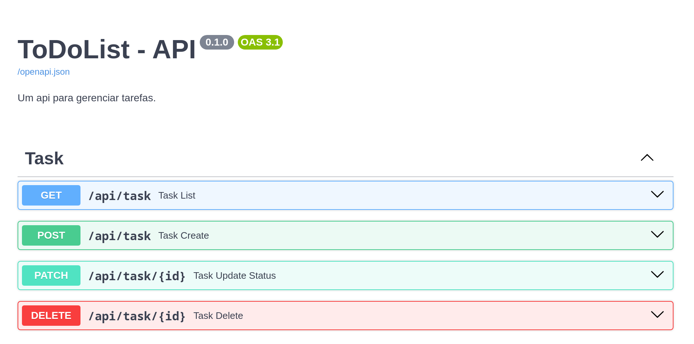
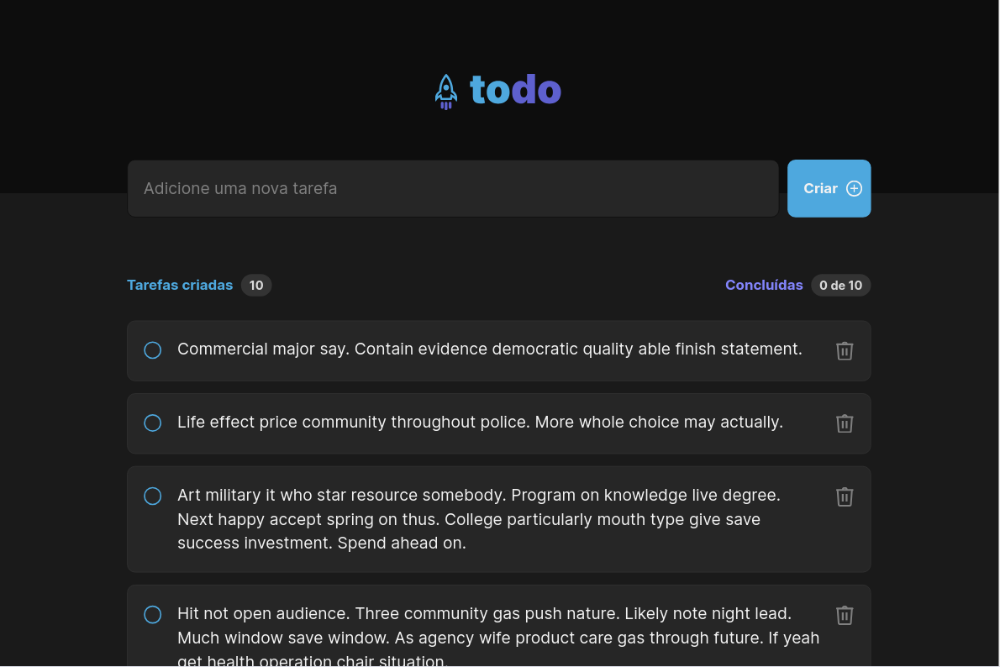
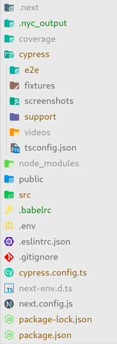

# ToDoList NextJS Cypress

Este projeto trata-se de uma aplicação para gerenciar tarefas (simples). O principal objetivo deste projeto é o estudo de testes com o **Cypress**.

### Figma

Desenvolvido pela Rocketseat

[Link](https://www.figma.com/file/jsURGwrwomXjy9yH6dzL2V/ToDo-List---DONE?type=design&node-id=43-88&mode=design&t=8D3tz7DGzWpaGqBM-0)

### Backend - Documentation



### Visual da Página



## Introdução ao Cypress (Test. Automate. Accelerate)

O **Cypress** é uma ferramenta para testes automatizados semelhante ao Selenium, possuindo as mesmas funcionalidades, porém com arquitetura diferente.

### Principais Features

- Tempo de busca
- Rápido

A arquitetura do **Cypress** é dividida em três principais componentes: Test Runner, Cypress Server e Browser.

- Test Runner: É uma GUI onde é possível depurar o teste, acessar a árvore de elementos.

- Cypress Server: É um processo em Node.js que roda em background e gerencia o Test Runner e o Browser. O Cypress usa uma única arquitetura "Dual Server" onde o Test Runner e o Cypress Server rodam em processos diferentes.

- Browser: É a instância do navegador que está executando o teste. A comunicação dessa instância com o Cypress é feita por meio de um protocolo próprio do Cypress chamado "Cypress Protocol". Este protocolo permite acesso à DOM e o tráfego de rede.


Fonte: https://www.infracloud.io/blogs/introduction-cypress-ui-test-automation/

### Instalação e Configuração

Pré-requisitos: Ter o Node.js instalado na sua máquina.

Você pode instalar com o seguinte comando:

```bash
npm install --save-dev cypress
ou
yarn add -D cypress
```

O próximo passo é fazer a configuração (e para isso o Cypress automatiza isso pra você)

```bash
npx cypress open
```

Este comando irá lançar a GUI padrão do Cypress e dar sugestões de configurações. Você pode usar o Cypress para executar testes pelo próprio terminal também, segue o comando:

```bash
npx cypress run
```

Este comando roda em modo headless.

### Estrutura do Projeto:



Na pasta cypress temos:

- support: Local para adicionarmos os custom commands que criamos, e para fazer configurações globais no frontend.
- fixtures: Destinado a armazenar dados (imagens, json, etc.).
- e2e: Pasta com os nossos testes e2e.
- screenshots: Pasta com imagens tiradas pelo próprio Cypress - sempre que usamos cy.screenshots(<nome-da-imagem>) ele armazena nesta pasta.
- videos: Pasta com vídeos, também controlada pelo Cypress.

### Recursos de Asserção e Comandos

Nesta parte eu acompanhei a documentação, dessa forma os textos|exemplos aqui é uma copia de trexos da própria documentação do cypress

#### Queries

- get

Get one or more DOM elements by selector or alias

**Syntax**

```ts
cy.get(selector);
cy.get(alias);
cy.get(selector, options);
cy.get(alias, options);
```

**Examples**

```ts
// Get one element
cy.get("input").should("be.disabled");

// Yield the <li>'s in .list
cy.get(".list > li");

// Find 5 elements with the given data attribute
cy.get('[data-test-id="test-example"]').should("have.length", 5);

// Find the element with id that starts with "local-"
cy.get("[id^=local-]");

// Find the element with id that ends with "-remote"
cy.get("[id$=-remote]");

// Find the element with id that starts with "local-" and ends with "-remote"
cy.get("[id^=local-][id$=-remote]");

// Get the aliased 'todos' elements
cy.get("ul#todos").as("todos");

cy.get("@todos");

// With cy.within
cy.get("form").within(() => {
  cy.get("input").type("Pamela"); // Only yield inputs within form
  cy.get("textarea").type("is a developer"); // Only yield textareas within form
});
```

- find

Get the descendent DOM elements of a specific selector.

**Syntax:**

```ts
.find(selector)
.find(selector, options)
```

**Usage:**

```ts
// Yield 'footer' within '.article'
cy.get('.article').find('footer')

//# Get li's within parent
<ul id="parent">
  <li class="first"></li>
  <li class="second"></li>
</ul>

// yields [<li class="first"></li>, <li class="second"></li>]
cy.get('#parent').find('li')
// yield <li class="first"></li>
cy.get('#parent').find('li').first()
```

- filter

Get the DOM elements that match a specific selector.

**Syntax:**

```ts
.filter(selector)
.filter(selector, options)
```

**Usage**

```ts
// Yield all el's with class '.users'
cy.get('td').filter('.users')

// Selector - Filter the current subject to the elements with the class 'active'
<ul>
  <li>Home</li>
  <li class="active">About</li>
  <li>Services</li>
  <li>Pricing</li>
  <li>Contact</li>
</ul>

// yields <li>About</li>
cy.get('ul').find('>li').filter('.active')

// Contains - Filter by text
<ul>
  <li>Home</li>
  <li>Services</li>
  <li>Advanced Services</li>
  <li>Pricing</li>
  <li>Contact</li>
</ul>

cy.get('li').filter(':contains("Services")').should('have.length', 2)
```

- not

Filter DOM element(s) from a set of DOM elements - Opposite of .filter()

**Syntax:**

```ts
.not(selector)
.not(selector, options)
```

**Usage**

```ts
// Yield all inputs without class '.required'
cy.get('input').not('.required')

// Selector - Yield the elements that do not have class active
<ul>
  <li>Home</li>
  <li class="active">About</li>
  <li>Services</li>
  <li>Pricing</li>
  <li>Contact</li>
</ul>

cy.get('ul>li').not('.active').should('have.length', 4) // true
```

- as

Assign an alias for later use. Reference the alias later within a cy.get() query or cy.wait() command with an @ prefix.

**Syntax**

```ts
.as(aliasName)
.as(aliasName, options)
```

**Usage**

```ts
// Aliasing a DOM element and then using cy.get() to access the aliased element
it("disables on click", () => {
  cy.get("button[type=submit]").as("submitBtn");
  cy.get("@submitBtn").click().should("be.disabled");
});

// Intercept
cy.intercept("PUT", "/users", { fixture: "user" }).as("editUser");
cy.get("form").submit();
cy.wait("@editUser").its("url").should("contain", "users");
```

#### Asserts

- should

Create an assertion. Assertions are automatically retried until they pass or time out.

**Syntax:**

```ts
.should(chainers)
.should(chainers, value)
.should(chainers, method, value)
.should(callbackFn)
```

**Usage:**

```ts
cy.get('.error').should('be.empty') // Assert that '.error' is empty
cy.contains('Login').should('be.visible') // Assert that el is visible

// Assert the checkbox is disabled
cy.get(':checkbox').should('be.disabled')

// Assert the class is 'form-horizontal'
cy.get('form').should('have.class', 'form-horizontal')

// Assert the anchor element has href attribute
cy.get('#header a').should('have.attr', 'href')


// Assert text content of 3 elements
<ul class="connectors-list">
  <li>Walk the dog</li>
  <li>Feed the cat</li>
  <li>Write JavaScript</li>
</ul>

cy.get('.connectors-list > li').should(($lis) => {
  expect($lis).to.have.length(3)
  expect($lis.eq(0)).to.contain('Walk the dog')
  expect($lis.eq(1)).to.contain('Feed the cat')
  expect($lis.eq(2)).to.contain('Write JavaScript')
})
```

#### Actions

- click

Click a DOM element.


**Syntax:**

```ts
.click()
.click(options)
.click(position)
.click(position, options)
.click(x, y)
.click(x, y, options)
```

**_Usage:_**

```ts
cy.get(".btn").click(); // Click on button
cy.focused().click(); // Click on el with focus
cy.contains("Welcome").click(); // Click on first el containing 'Welcome'
```

- dblclick

Double-click a DOM element.

- rightclick

Right click a DOM element.

- type

Type into a DOM element.

**Syntax**

```ts
.type(text)
.type(text, options)
```

**Usage**

```ts
// Type 'Hello, World' into the 'input'
cy.get("input").type("Hello, World");
```

- check

Check checkbox(es) or radio(s).

**Syntax**

```ts
.check()
.check(value)
.check(values)
.check(options)
.check(value, options)
.check(values, options)
```

**Usage**

```ts
// Check checkbox element
cy.get('[type="checkbox"]').check()

// Check first radio element
cy.get('[type="radio"]').first().check()

//# Select the radio with the value of 'US'
<form>
  <input type="radio" id="ca-country" value="CA" />
  <label for="ca-country">Canada</label>
  <input type="radio" id="us-country" value="US" />
  <label for="us-country">United States</label>
</form>

cy.get('[type="radio"]').check('US')

//# Check the checkboxes with the values 'subscribe' and 'accept'
<form>
  <input type="checkbox" id="subscribe" value="subscribe" />
  <label for="subscribe">Subscribe to newsletter?</label>
  <input type="checkbox" id="acceptTerms" value="accept" />
  <label for="acceptTerms">Accept terms and conditions.</label>
</form>

cy.get('form input').check(['subscribe', 'accept'])
```

- uncheck

Uncheck checkbox(es).

- clear: An alias for .type('{selectall}{backspace}')

Clear the value of an input or textarea.

**Syntax**

```ts
.clear()
.clear(options)
```

**Usage**

```ts
// Clear text input
cy.get('[type="text"]').clear();

// Clear textarea
cy.get("textarea").type("Hi!").clear();

// Clear focused input/textarea
cy.focused().clear();
```

- select

Select an <option> within a <select>.

**Syntax**

```ts
.select(value)
.select(values)
.select(value, options)
.select(values, options)
```

**Usage**

```ts
cy.get('select').select('user-1') // Select the 'user-1' option

// Asserts - Select the option with the text apples
<select>
  <option value="456">apples</option>
  <option value="457">oranges</option>
  <option value="458">bananas</option>
</select>

// yields <option value="456">apples</option>
cy.get('select').select('apples').should('have.value', '456')
```

- selectFile

Selects a file or files in an HTML5 input element or simulates dragging a file or files into the browser.

**Syntax**

```ts
.selectFile(file)
.selectFile(file, options)
.selectFile([file1, file2, ...])
.selectFile([file1, file2, ...], options)
```

**Usage**

```ts
cy.get("input[type=file]").selectFile("file.json");
cy.get("input[type=file]").selectFile(["file.json", "file2.json"]);

cy.get("input[type=file]").selectFile({
  contents: Cypress.Buffer.from("file contents"),
  fileName: "file.txt",
  mimeType: "text/plain",
  lastModified: Date.now(),
});

cy.get("input[type=file]").selectFile("file.json", { action: "drag-drop" });
cy.document().selectFile("file.json", { action: "drag-drop" });
```

**Example:**

```ts
// cypress/e2e/upload-file.cy.ts
describe("Upload file page", () => {
  it("should be possible to upload a file", () => {
    cy.visit("/upload-file");

    cy.get("input:first").selectFile(
      "cypress/fixtures/coordinates-diagram.jpg"
    );

    cy.get("img").should("be.visible");
  });
});
```

#### Others commands

- clearAllCookies
- clearAllLocalStorage
- fixture

Load a fixed set of data located in a file.

**Syntax**

```ts
cy.fixture(filePath);
cy.fixture(filePath, encoding);
cy.fixture(filePath, options);
cy.fixture(filePath, encoding, options);
```

**Usage**

```ts
// load data from users.json
cy.fixture("users").as("usersJson");

// load data from images
cy.fixture("logo.png").then((logo) => {
  // load data from logo.png
});

// Get data from {fixturesFolder}/users/admin.json
cy.fixture("users/admin.json");
```

- focus
- hover
- session
- wait
- within
- task

Execute code in Node via the task plugin event.

**Syntax**

```ts
cy.task(event);
cy.task(event, arg);
cy.task(event, arg, options);
```

**Usage**

```ts
// in test
cy.task("log", "This will be output to the terminal");

// in cypress.config.ts
import { defineConfig } from "cypress";

export default defineConfig({
  // setupNodeEvents can be defined in either
  // the e2e or component configuration
  e2e: {
    setupNodeEvents(on, config) {
      on("task", {
        log(message) {
          console.log(message);

          return null;
        },
      });
    },
  },
});
```

#### Customizando comandos - Uma abordagem ao (factory pattern)

O cypress fornece uma maneira de criamos nossos próprios comandos, ou customizar os comandos existêntes.

Para isso podemos usar duas API:

Cypress.Commands.add() - Usado para definimos novos comandos
Cypress.Command.overwrite() - Usado para sobrescrevemos comandos já existêntes

Exemplo 1: Digamos que você esteja testando uma aplicação de ToDoList e em diversos locais necessita de criar uma tarefa, então podemos escrever um custom command para não ter que fazer todo processo de criar tarefa manual toda vez que precisar criar uma tarefa.

Dentro do arquivo support/commands.ts você pode fazer algo do tipo:

```ts
Cypress.Commands.add("createTask", (name) => {
  cy.get('input[type="text"]').type(name);
  cy.get("button").contains("Criar").click();
});
```

Exemplo 2: Trabalhando com localstorage

```ts
Cypress.Commands.add("getSessionStorage", (key) => {
  cy.window().then((window) => window.sessionStorage.getItem(key));
});

Cypress.Commands.add("setSessionStorage", (key, value) => {
  cy.window().then((window) => {
    window.sessionStorage.setItem(key, value);
  });
});
```

Exemplo 3: Login no sistema via UI

```typescript
Cypress.Commands.add("loginViaUi", (user) => {
  cy.session(
    user,
    () => {
      cy.visit("/login");
      cy.get("input[name=email]").type(user.email);
      cy.get("input[name=password]").type(user.password);
      cy.click("button#login");
      cy.get("h1").contains(`Welcome back ${user.name}!`);
    },
    {
      validate: () => {
        cy.getCookie("auth_key").should("exist");
      },
    }
  );
});
```

#### Como trabalhar com variaveis de ambiente ?

O cypress fornece um objeto Cypress.env que serve para podermos manipular as nossas variaveis de ambiente.

**Syntax**

```ts
Cypress.env();
Cypress.env(name);
Cypress.env(name, value);
Cypress.env(object);
```

Primeiro configure as variaveis de ambiente no seu arquivo cypress.config.(ts|js) ou podemos usar o plugin **cypress-plugin-dotenv** que carregar todas as variaveis de ambiente do próprio arquivo .env e adiciona dinâmicamente no attrs env do arquivo de configuração do cypress.

```ts
import { defineConfig } from "cypress";

export default defineConfig({
  env: {
    foo: "bar",
    baz: "quux",
  },
});
```

Após a configuração feita podemos acessar os dados nos nossos arquivos de testes.

```ts
Cypress.env(); // => {foo: 'bar', baz: 'quux'}
```

Outra maneira de configurar as variaveis de ambiente é com a própria CLI no momento de iniciar a aplicação.

#### Aprenda praticando:

Teste seu primeiro projeto

https://learn.cypress.io/testing-your-first-application
